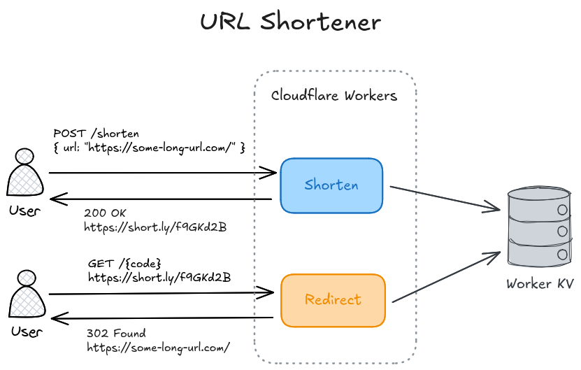

# Lynky

A small and simple URL shortener build on edge technology.

## Getting Started

Clone the repository and install all dependencies using [pnpm](https://pnpm.io/).

```sh
pnpm install
```

Copy `wrangler.example.jsonc` to `wrangler.jsonc` and `.env.example` to `.env`:

```sh
cp wrangler.example.jsonc wrangler.jsonc
cp .env.example .env
```

Generate a random auth token and put it into the `AUTH_TOKEN` variable in the `.env` file:

```sh
echo "AUTH_TOKEN=$(openssl rand -hex 32)" >> .env
```

Create a new [Cloudflare Workers KV](https://developers.cloudflare.com/kv/) namespace and add it to the `wrangler.jsonc`.

```sh
pnpm wrangler kv namespace create LYNKY_DATA
```

Run a development server:

```sh
pnpm dev
```

## Usage

To use the app from the command line you can use a tool like the [httpie CLI](https://httpie.io/cli).

Call the `/shorten` endpoint to generate a new short link. Send the token you have configured using the `AUTH_TOKEN` secret variable as a bearer token to authenticate to the service.

```sh
http -A bearer -a "<AUTH_TOKEN>" POST :8787/shorten url=https://duckduckgo.com/
```

Entering the returned URL e.g. in the browser will automatically redirect to the original URL.

## Deployment

To deploy the app to Cloudflare, make sure you have created and configured a KV namespace and auth token secret first, then run the `deploy` command.

```sh
pnpm wrangler secret put AUTH_TOKEN
pnpm deploy
```

## Development

[For generating/synchronizing types based on your Worker configuration run](https://developers.cloudflare.com/workers/wrangler/commands/#types):

```sh
pnpm cf-typegen
```

### Architecture


